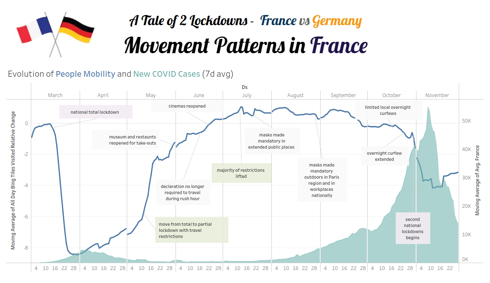

# Covid-19 Movement Analysis
### Tableau Visualisation Project.

## Project

Explore the change in people's movement patterns in 2020, with Covid-19 restrictions, visualising the data to tell a story

We decided to look at the different approaches and restrictions used by France and Germany, comparing how people responded to different levels of enforcement.

## Data

Facebook Data for Good - Movement Trends. https://visualization.covid19mobility.org/

Covid-19 Daily New Cases. https://ourworldindata.org/coronavirus-source-data

## Analysis

Pin pointing the dates specific measures and restrictions were introduced, we were able to see what effect these had on the number of daily new cases reported.
When initial measures were brought in, the populations of both countires dramtically stopped the way the move around. We can see a slight change around Easter in Germany, when the government slightly eased the restrictions.

## Findings

The level of enforcement in France for the second lockdown was much stronger. We can see the effect of this in way peoples movement patterns change. In Germany, the partial lockdown meant that as schools, kindergartens and non essential shops remain open, although there is a slight reduction, people are still moving around.

## Conclusion

